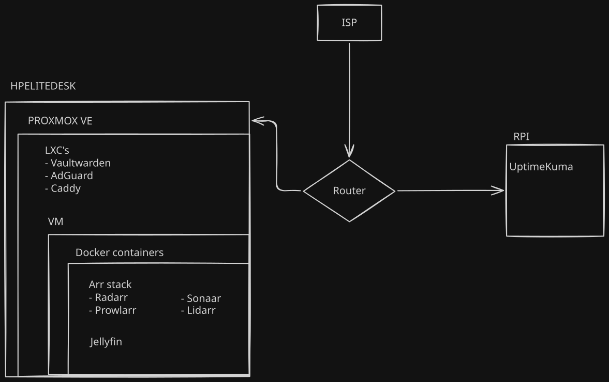

This is an archive of the current state of my homelab in order to remember me how to configure it all again.
Right now I have the main server (hp elitedesk) and an old raspberry 3b for monitorization.

The main server is running a [ProxmoxVE](https://www.proxmox.com/en/) with some LXC and a VM. The raspberry is running [UptimeKuma](https://uptimekuma.org/) as a web monitor for
my deployed projects.

